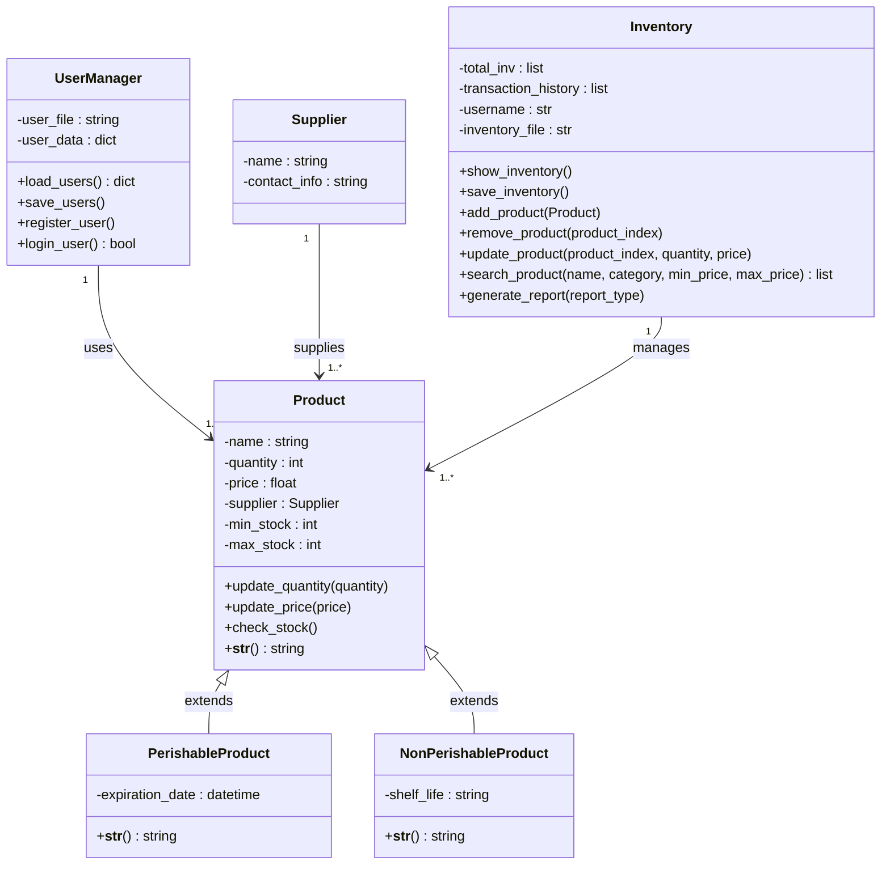

# proyecto-POO

# Inventory Management System

This repository contains a simple inventory management system built in Python. The system manages user authentication, product details, and inventory operations for both perishable and non-perishable products.

## Mermaid



## Overview

The code is organized into several classes, each with specific responsibilities:

1. **User Management**:
    - `UserManager`: Handles user registration and login, with credentials stored in a JSON file.

2. **Product Management**:
    - `Product`: A base class representing a generic product with attributes like name, quantity, price, supplier, and stock levels.
    - `PerishableProduct`: Inherits from `Product`, adding an expiration date.
    - `NonPerishableProduct`: Inherits from `Product`, adding a shelf life.

3. **Supplier Management**:
    - `Supplier`: Represents a supplier with a name and contact information.

4. **Inventory Management**:
    - `Inventory`: Manages the list of products in stock, including adding, removing, updating, and searching products. It also handles the generation of various inventory reports.

## Detailed Class Breakdown

### UserManager
This class manages user accounts. Users are stored in a `users.json` file, and the class provides methods to load, save, register, and authenticate users.

- **Attributes**:
  - `user_file`: The file where user data is stored.
  - `user_data`: A dictionary holding user credentials.

- **Methods**:
  - `load_users`: Loads user data from the JSON file.
  - `save_users`: Saves user data to the JSON file.
  - `register_user`: Allows new users to register.
  - `login_user`: Authenticates existing users.

### Supplier
The `Supplier` class holds basic information about suppliers, including their name and contact information.

### Product
A base class representing a product in the warehouse.

- **Attributes**:
  - `name`, `quantity`, `price`, `supplier`, `min_stock`, `max_stock`: Basic attributes describing the product.
  
- **Methods**:
  - `update_quantity`: Updates the product's quantity.
  - `update_price`: Updates the product's price.
  - `check_stock`: Checks if the product is within the stock limits.

### PerishableProduct
This class represents products that have an expiration date, extending the base `Product` class.

- **Attributes**:
  - Inherits from `Product`.
  - `expiration_date`: The date after which the product is no longer usable.

### NonPerishableProduct
This class represents products with a shelf life, also extending the base `Product` class.

- **Attributes**:
  - Inherits from `Product`.
  - `shelf_life`: The duration for which the product can be stored.

### Inventory
The `Inventory` class manages the warehouse's stock of products.

- **Attributes**:
  - `total_inv`: A list of products currently in inventory.
  - `transaction_history`: A log of all transactions performed on the inventory.
  - `username` : Register some actions on inventory.
  - `ìnventory_file` : Path for file.

- **Methods**:
  - `show_inventory`: Displays all products in the inventory.
  - `add_product`: Adds a new product to the inventory.
  - `remove_product`: Removes a product from the inventory by index.
  - `update_product`: Updates the quantity and/or price of a product.
  - `search_product`: Searches for products based on name, category, or price range.
  - `generate_report`: Generates various types of reports, including full inventory, low stock, expiring soon, and expired products.
  - `save_inventory`: Method is used to persist the current state of the inventory to a file or database. This ensures that all changes made to the inventory are saved and can be restored in future sessions

## Main.py: Application Workflow

1. **User Registration/Login**:
   - Users can register or log in to access the warehouse management features.
   
2. **Inventory Management**:
   - After logging in, users can add, remove, edit, and search for products.
   - They can also generate inventory reports, including:
     - Full inventory
     - Low stock levels
     - Products expiring soon
     - Expired products

3. **Reports**:
   - The system can generate different types of inventory reports, which are crucial for managing stock levels and ensuring that perishable goods are handled properly.


# Inventory Management System

This repository contains a simple inventory management system built in Python. The system manages user authentication, product details, and inventory operations for both perishable and non-perishable products.

## GUI Implementation

Before running the application, make sure to install `customtkinter` by running the following command:

```bash
pip install customtkinter 
```

In addition to the backend logic for managing users and inventory, we have implemented a Graphical User Interface (GUI) using `customtkinter`, an extended version of the traditional `tkinter` library that provides modern and customizable UI elements.

### Overview of the GUI

The GUI provides an intuitive and user-friendly interface for interacting with the inventory management system. It includes the following features:

1. **Login and Registration Screen**:
   - Users can log in or register a new account using the login screen.
   - The interface provides fields for entering a username and password, along with buttons to log in or register.

2. **Inventory Management Screen**:
   - After a successful login, users are redirected to the inventory management screen.
   - The screen allows users to add, update, or remove products from the inventory.
   - It includes input fields for product details such as name, quantity, price, supplier, minimum and maximum stock levels.
   - Users can also generate reports of the inventory directly from the interface.

3. **Actions and Functionalities**:
   - **Add Product**: Allows users to add new products to the inventory by filling in the required fields.
   - **Update Product**: Users can update existing product details, such as quantity and price.
   - **Remove Product**: Provides functionality to remove products from the inventory.
   - **Generate Report**: Generates detailed inventory reports, which include all the products currently in stock.
   - **Log Out**: Logs the user out and returns to the login screen.
   - **Exit**: Exits the application.

### Technical Details

- The GUI is built using `customtkinter`, which is a more modern and customizable extension of the default `tkinter` library. It offers enhanced styling options and improved widgets, making the application look modern and user-friendly.
- The GUI components are organized using frames and grids to ensure a responsive and centered layout.
- User inputs are validated before being processed, ensuring that the data entered is correct and within acceptable ranges.

### How to Use the GUI

1. **Starting the Application**:
   - Run the application by executing the main Python script.
   - The application window will center itself on your screen and display the login interface.

2. **Logging In or Registering**:
   - Enter your username and password to log in.
   - If you don't have an account, click on "Register" to create a new user account.

3. **Managing Inventory**:
   - After logging in, use the inventory management screen to add, update, or remove products.
   - Generate reports to view the current state of the inventory.

4. **Exiting the Application**:
   - You can log out to return to the login screen or exit the application directly from the inventory management screen.

This GUI implementation provides a seamless and efficient way for users to manage inventory without needing to interact with the backend code directly, enhancing the overall user experience of the Inventory Management System.
